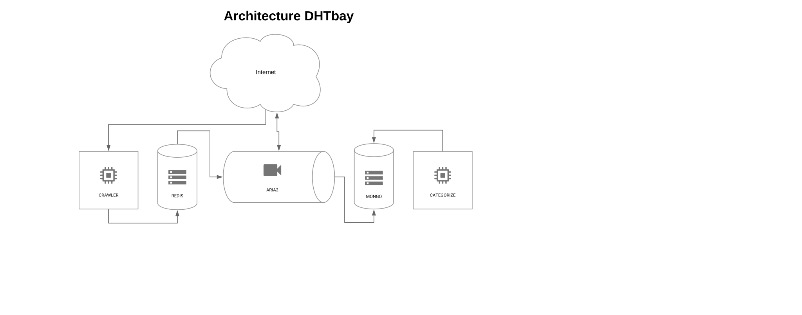

# dht-bay
A DHT crawler, torrent indexer and search portal all in nodeJS

DEPENDENCIES
------------

This project works fine with :
- node 6.3.1
- npm 3.10.3
- redis-server 2.8.17
- mongod 2.4.10
- aria2 1.33.1

INSTALL
-------

#### Good to know

You should open your 6881/udp port to allow the crawler to have access to DHT network.

#### Use docker

Or you can just use the docker project version and run it using :

```
docker-compose up -d
```

It will automatically launch redis, mongo and aria2 then start crawling and categorizing for you. You'll have your DHT Crawler up and running. Crawling may take some time so be patient.

ARCHITECTURE
------------

This diagram presents an overview of the project architecture and how each piece communicate with each other.



CONTENT
-------

The project is composed of 4 modules as presented. Each module is independant and can be used separately without problem.

+  **crawlDHT.js** is responsible for crawling hashs from the DHT network. It will push hashes on a redis list called *DHTS*. It also provides a routing table backup system saving it each 10 minutes in a mongo collection called table.
+  **loadDHT.js** is responsible of loading hashes from the redis list *DHTS* and to download torrent metadat for indexation. It rely intensely on *aria2* tool and tray to download it from torcache, torrage and through DHT.
+  **loadTorrent.js** is responsible of saving metadatas into our mongo instance in collection torrents. This will be our basis data.
+  **categorize.js** will try to categorize crawled torrent depending on file extensions. Because module only takes a limited number of extensions in account you can use classifier too.
+  **classifier.js** a bayesian classifier that will classify torrent that couldn't be classed by previous one. In order to work you need to train the classifier.
+  **trainer.js** the bayesian classifier trainer, based on categorize script classification it helps unknown torrent classification.

You could use the bayesian classifier when you've already had a bunch of torrent indexed. The more samples you'll have the more accurate it will be.

Please fork it, and use it everywhere you can.

IMPROVEMENTS
------------

+ Improve categorization to support more extensions. Use a [categorized API](https://github.com/FlyersWeb/file-extension-api).

Have fun.

@flyersweb
